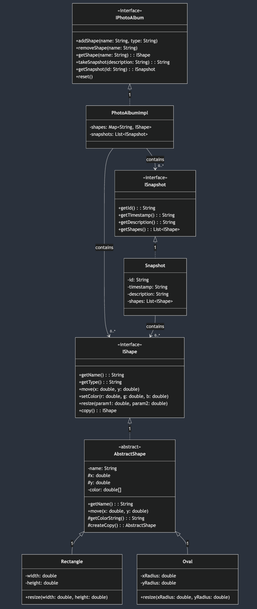

# Shape Photo Album Model

A model for a photo album application that works with 2D shapes. Lets you create shapes, move them around, change their colors, and take snapshots to save their state at different points in time.

## Main Components

### Core Classes
- `IPhotoAlbum`: The main interface you'll work with. Create shapes, move them, take snapshots.
- `IShape`: Everything a shape needs to do - move, resize, change color.
- `ISnapshot`: Takes a picture of all shapes at a moment in time. Like hitting pause.

### The Building Blocks
- `PhotoAlbumImpl`: Does the heavy lifting. Keeps track of shapes and snapshots.
- `AbstractShape`: Parent class for all shapes. Handles common stuff like color and position.
- `Rectangle`: A shape with width and height, positioned by its corner.
- `Oval`: A shape with x and y radii, positioned by its center.
- `Snapshot`: Takes a picture of shapes and keeps it safe from changes.

## UML / Design Choices

- An album can have 0 to many shapes (0..*)
- An album can have 0 to many snapshots (0..*)
- A snapshot can contain 0 to many shapes (0..*)


---

## Quick Example
```java
// Create an album and add some shapes
IPhotoAlbum album = new PhotoAlbumImpl();

// Make a red rectangle
album.addShape("R1", "rectangle");
IShape rect = album.getShape("R1");
rect.move(100, 100);
rect.resize(50, 30);
rect.setColor(1.0, 0.0, 0.0);

// Take some snapshots as you go
String id1 = album.takeSnapshot("Starting position");
rect.move(200, 200);
String id2 = album.takeSnapshot("Moved rectangle");
```

## Behind the Scenes
```java
public class PhotoAlbumImpl implements IPhotoAlbum {
    private final Map<String, IShape> shapes = new HashMap<>();
    private final List<ISnapshot> snapshots = new ArrayList<>();

    public void addShape(String name, String type) {
        if (shapes.containsKey(name)) {
            throw new IllegalArgumentException("Already have a shape named " + name);
        }
        IShape shape = switch (type.toLowerCase()) {
            case "rectangle" -> new Rectangle(name, 0, 0, 50, 50);
            case "oval" -> new Oval(name, 0, 0, 25, 25);
            default -> throw new IllegalArgumentException("Don't know how to make a " + type);
        };
        shapes.put(name, shape);
    }

    public String takeSnapshot(String description) {
        ISnapshot snapshot = new Snapshot(new ArrayList<>(shapes.values()), description);
        snapshots.add(snapshot);
        return snapshot.getId();
    }
}
```

### How It All Works Together

- Shapes are stored in a Map for quick lookup by name
- Snapshots are kept in order in a List 

>When you take a snapshot:
Creates copies of all current shapes
Timestamps the moment
Stores everything in a new Snapshot object
Adds it to the history list


>When shapes change:
Original shapes update in the Map
Old snapshots keep their copies unchanged
New snapshots see the current state


>This lets you:
Find shapes quickly by name (using Map)
Keep track of changes over time
Go back to any previous state
Never accidentally change history
---

## Why It Works This Way
- Interfaces make it easy to add new types of shapes later
- Snapshots make copies so you can't accidentally change history
- Base shape class keeps common code in one place
- Factory method keeps shape creation organized
- Everything's tested to make sure it works as expected

## Error Checking
- Won't let you create two shapes with the same name
- Checks that colors are valid (between 0 and 1)
- Makes sure shapes have valid sizes
- Gives helpful error messages when something's wrong

## Testing
Makes sure:
- Shapes are created and move correctly
- Snapshots save the right information
- Invalid operations are caught
- History is preserved correctly
- Output looks right
