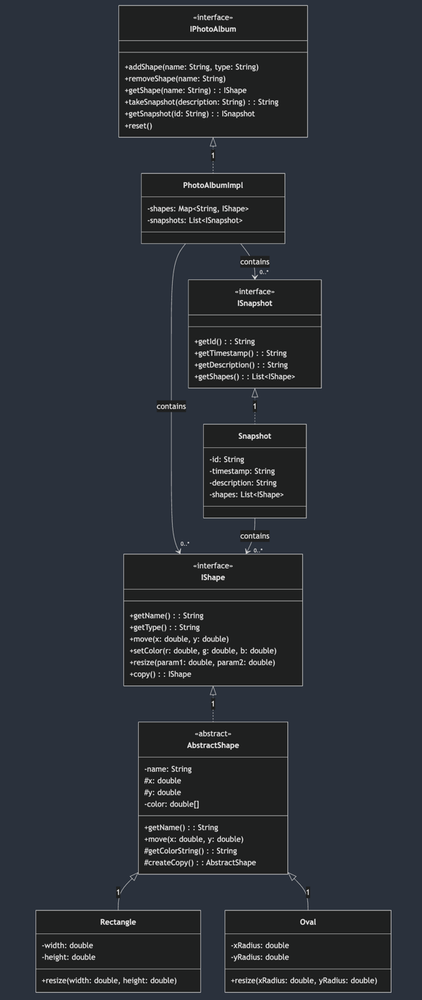

# Photo Album Viewer

A simple but powerful application for creating and viewing collections of 2D shapes. Create shapes, move them around, and take snapshots to preserve different arrangements. View your snapshots either in an interactive window or as a web page.

## Core Features

- Create rectangles and ovals with custom colors and sizes
- Move and resize shapes freely
- Take snapshots to save shape arrangements
- View snapshots in a graphical window or web browser
- Navigate through snapshots with Previous/Next buttons
- Jump directly to any snapshot you want

## Project Structure

### Model
The heart of the application that handles shapes and snapshots:
- `IPhotoAlbum`: Main interface for working with the album
- `IShape`: Base interface for all shapes (rectangles, ovals)
- `ISnapshot`: Interface for capturing shape states
- `PhotoAlbumImpl`: Main album implementation

### Views
Two ways to look at your snapshots:

**Graphical View (SwingView)**
- Interactive window for viewing snapshots
- Navigation buttons (Previous/Next)
- Jump to any snapshot from a dropdown
- Shows snapshot info and descriptions

**Web View**
- Generates a static HTML page
- All snapshots visible at once
- SVG graphics for crisp rendering
- Print-friendly layout

##  UML Diagram


## Quick Start

```java
// Create your photo album
IPhotoAlbum album = new PhotoAlbumImpl();

// Add a shape
album.addShape("rect1", "rectangle");
IShape rect = album.getShape("rect1");

// Style it
rect.move(100, 100);
rect.resize(50, 30);
rect.setColor(1.0, 0.0, 0.0);  // Bright red

// Take some snapshots
album.takeSnapshot("My first shape");
rect.move(200, 200);  // Move it around
album.takeSnapshot("Shape in new position");

// View it!
IPhotoAlbumView view = new SwingView(album, 800, 600);
view.display();
```

## Running the Application

### Directory Setup
First, navigate to the jar location:
```bash
cd out/artifacts/shape_photoalbum_jar
```

### Command Formats

**Graphical View:**
```bash
java -jar shape_draw.jar -in <input-file> -view graphical <width> <height>
```

**Web View:**
```bash
java -jar shape_draw.jar -in <input-file> -view web -out <output-file>
```

### Complete Examples

View buildings in graphical window:
```bash
cd out/artifacts/shape_photoalbum_jar
java -jar shape_draw.jar -in buildings.txt -view graphical 800 800
```

Generate HTML output:
```bash
cd out/artifacts/shape_photoalbum_jar
java -jar shape_draw.jar -in buildings.txt -view web -out buildings.html
```

View basketball animation:
```bash
cd out/artifacts/shape_photoalbum_jar
java -jar shape_draw.jar -in hoops.txt -view graphical 1000 1000
```

Create web page from demo:
```bash
cd out/artifacts/shape_photoalbum_jar
java -jar shape_draw.jar -in demo_input.txt -view web -out out.html
```

## Under the Hood

The album keeps your shapes in a map for quick access by name. When you take a snapshot, it makes copies of all shapes to preserve their exact state at that moment. This means you can freely modify shapes without worrying about messing up your history.

Each snapshot remembers:
- Which shapes existed
- Where they were
- What they looked like
- When it was taken
- Your description (if any)

The views can only look at the data - they can't change anything. This keeps your shape history safe and consistent.

## Common Issues & Solutions

- "Shape already exists": Each shape needs a unique name
- "Invalid color": Color values must be between 0 and 1
- "Invalid size": Shape dimensions must be positive
- Navigation errors: You'll get a message if you try to go past the first/last snapshot

## Technical Details

The model uses:
- HashMap for shape storage (fast lookups)
- ArrayList for snapshots (maintains order)
- Deep copies for snapshot preservation
- Factory pattern for shape creation

Views handle:
- Custom shape rendering
- Proper layering (background first, details last)
- Event-driven navigation
- Error handling and user feedback

## What's Next?

Some ideas for future enhancements:
- More shape types (triangles, stars)
- Shape grouping
- Animation between snapshots
- Custom shape colors using a color picker
- Export/import album data

## Testing

We've got thorough tests covering:
- Shape creation and modification
- Snapshot operations
- Error handling
- View rendering
- Navigation features

Every feature has multiple tests to ensure it works reliably.

Let me know if you'd like me to explain any part in more detail!